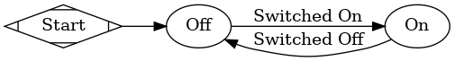
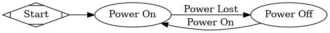
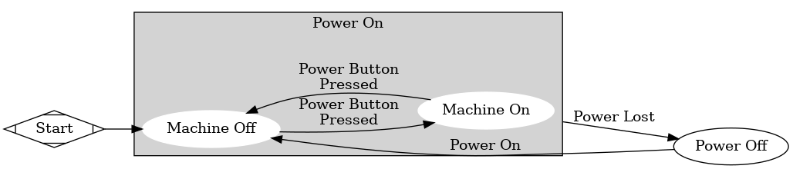
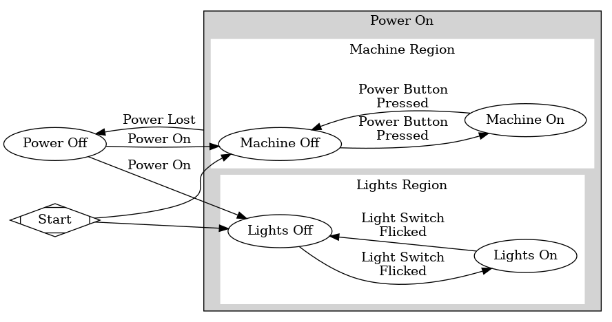
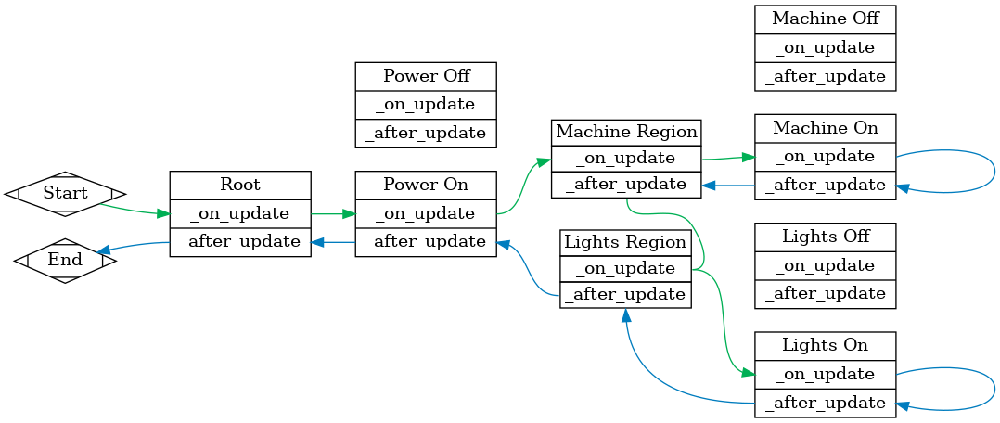

# Addons
Any *Godot* addons - other people's code and assets distributed through the *Godot Asset Library* - go here.

## Godot Navigation Lite
As of this writing, the current version of Godot doesn't support dynamic navigation meshes (i.e. navigate meshes that can be baked in-game). This is very bad for a procedurally generated game, like ours.

This library, by **Miloš Lukić**, solves that issue by providing a navigation mesh that can be baked on the fly as we add or remove obstacles. It works... pretty well. I've noticed that it kind of struggles with the peaked roofs of buildings. Other than that, I'm happy with it.

However, it doesn't support Mac OS, which severely limits the platforms we can target. It's also got limited obstacle avoidance. In recognition of this, we'll probably remove it whenever Godot 4.0 comes out, since that version will support dynamic navigation meshes natively.

## Qodot
One particular gripe I've had with Godot is the lack of an easy way to make models, or a level editor of any kind. Apparently, this is a gripe that's actually common across Unity, Unreal, and Godot. You have to create levels in some sort of third party editor like Blender and then import those in.

This addon by **Josh Palmer** (and several others, it seems) allows us to import Quake style `.map` files into Godot. That's pretty neat, but when paired with the incredible *TrenchBroom* level editor, it makes levels and other complex geometry super easy.

I used to use the *Valve Hammer Editor* (generally just called *Hammer*) to make *Left 4 Dead 2* levels when I was younger. While it's not 1:1, the interface of *TrenchBroom* is very similar; it's also an absolute joy to use.

A quick note - in order to build the `QodotMap` nodes, you need to specify the FULL file path in each scene. So you'll need to change that if you're trying to rebuild scenes or something.

## XSM Extended State Machine
This library, created by **Etienne Blanc**, provides us with a solid foundation for making a state machine in Godot. It provides a pretty solid basis and, better yet, it's written entirely in GDScript - that means it should be compatible with all platforms and with Godot 4.0.

My only problem with this library is that there's only one update method - `_on_update(_delta)`. This is actually wrapped in the `_physics_process` call, meaning it's always a Physics update. I'm not a fan of that because it doesn't allow us to make use of the parallel `_process` call. Simpler, I know, but not exactly better. I may modify this plugin so that we have update functions for both physics and regular processes.

Looking at the example it looks like the solution is to spread the functionality across multiple state updates, since those run somewhat in parallel. We'll work with it, as it is, for now.

### Explanation
It took me a while to wrap my head around how extended state machines work, so I thought it would be worth it to document exactly how these things work.

##### State Machines

This addon implements *StateCharts* which are a lot like state machines, but a bit more complex. For those not in the know, *Finite State Machines* (usually just called state machines, sometimes abbreviated as *FSM*) are a way of modeling some sort of process. Take, for example, this incredibly basic state machine:

This is a state machine for, say, a lightbulb. Or literally anything that turns on. Anyway, a state machine is composed of **nodes** that represent the states (*On* and *Off* above) and the **edges** that connect those nodes (*Switched On* and *Switched Off* above).

The *edges* are typically annotated with the condition that causes a transition. These typically take the form of actions (i.e. *Switched On*). In some more complex instances - like AI, for example - you'll see the *edges* annotated with statistical probabilities. 

You start at *Start* and then, by following the arrows and choosing the different actions available at each node, you can follow how a program works. There is never more than one node active at a time.

State Machines are popular for documenting how programs work. There are some in the field of software development who push the idea further and say that programs should be designed and programmed as state machines. There are actually programs out there that allow you create state machines and similar diagrams and generate code off the back of that. This is also the core concept behind *visual programming* languages. Godot itself offers *VisualScript* for programming and *VisualShader*s for implementing shaders.

##### State Charts

*StateCharts* are an extension of *State Machines*. They bring two important improvements over state machines. First, it introduces *super states*, also called *compund states*. *Super States* are states that can contain state machines themselves, and execute those state machines while active. For example, let's say we have this simple state machine:

We can expand the *Power On* state by making it a super state that contains our other basic state machine. Let's say there's some machine that can only be turned on when the power is on. This would look like so:

*StateCharts* also allow for states to have multiple "regions". When a state has regions, each substate is treated as it's own machine and is active. Expanding on the above chart, let's say we have lights in addition to the "machine". That would be this:

##### The Extended State Machines Addon
The *Extended State Machines* addon (abbreviated *XSM*) provides a *StateCharts* implementation framework (or something like that) in Godot. With *XSM*, each state is a node. Each state becomes a *super state* when you add states directly under it. Each state has a *Has Regions* configurable, indicating the subordinates states are *Regions* and should be run separately.

For example, our incredibly basic two-state XSM would look like this:

Notice how the *Start* node has been replaced with a *Root* node. With *XSM*, you always need  a *Root* node that exists as a *super state* for all of the states in the machine. That's how a *XSM* will know what states to run.

Transitioning between the states relies on calling the `change_state("MyState")` or `goto_state("MyState")` functions from code. See the README included in the addons directory for more information.

To create a *super state*, we simply need to place nodes under it. As we did before, we can expand the *Power On* node by adding *Machine Off* and *Machine On* states:

And managing regions is much the same - let's move the machine under a region and add a lights region, as we did before:

##### Code Execution
Now the real complex part of *XSM* is the execution sequence. *XSM* provides multiple function hooks - functions that we can overwrite in code as part of the actual execution process. These are listed in the README for *XSM* - we're gonna concern ourselves with two of them: `_on_update(_delta)` and `_after_update(_delta)`.

Let's say we have the following status in the scene above, where a colored-in node represents an active scene:

Notice how both of the "Region" nodes are colored in - that's because the *Power On* node is triggered and supports region nodes - meaning both the *Machine Region* and *Lights Region* are active.

The `_on_update()` function is called first. It starts at the scene root, and works it's way down. It goes depth-first, so it goes until it bottoms out. That means that our *Machine On* node will get called upon before our *Lights Region* node. This is illustrated via the following graph:

You can follow the path of the `_on_update` calls by following the green arrow above. Notice how all the states **above** *Machine On* are updated first; in this way, the state machine almost acts like a stack or a queue. States are appended or removed from the end at will.

Now here's where things get kooky: the `_after_update` function is called once a node and *all of it's children are updated*. This means the `_after_update` function is called first on the bottom-most node, and last on the top-most node. This can be observed in this diagram, where `_on_update` executions are green arrows and `after_update` calls are in blue:

Believe it or not, these states are somehow less complex than attempting to program this manually using standard imperative programming. Trust me, I tried. Even though they can be complex, the states are highly self contained. By focusing on just what a node needs to do - i.e. in the `_on_update` or the `_after_update` function - you can easily create some pretty robust functionality.