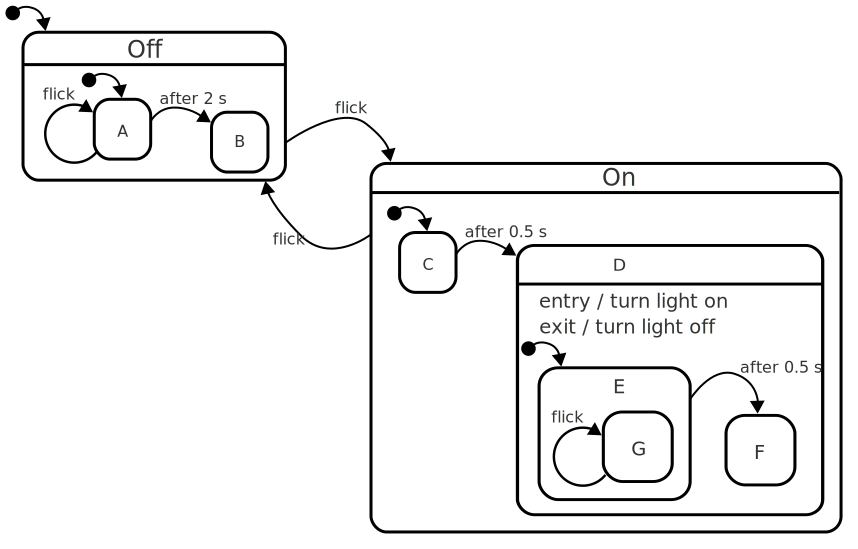
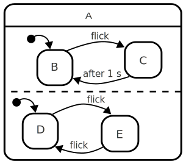

XSM Extended State Machine
==========================

A freely inspired implementation of [StateCharts](https://statecharts.github.io/what-is-a-statechart.html) for Godot. This plugin provides States composition, regions and helper functions for animations and timers. It is licensed MIT and written by [ATN](https://gitlab.com/atnb).


Understanding XSM
-----------------

A Finite State Machine (FSM) is a way for developpers to separate their code's logic into different parts. In Godot, it would be in different Nodes. XSM allows to have substates of a State so that you don't have to create a complex inheritage pattern. You can simply add State Nodes as children of a State Node. If you do so, when a child is active, all his parents are active too.

If a State has_regions, all its children are active or inactive at the same time, as soon as it is active or inactive.

It allows schemas such as :



_more on : [StateCharts](https://statecharts.github.io/what-is-a-statechart.html)_


How to use XSM
---------------

You can add a StateRoot node to your scene. This State wiil be the root of your XSM. Then you can add different States to this root and separate the logic of your scene into those different sub-States. You can also add a State as a child of another State and create complex trees of States by doing so.

An empty State template is provided in [`res://script_template/empty_state.gd`](https://gitlab.com/atnb/xsm/-/blob/master/script_templates/empty_state.gd). You just need to add a script to your State and specify this one as a model.

By default, your XSM is enabled, you can disable it (or any branch of you XSM's tree) in the inspector.

Each State can have its own target (any Node of the scene, including another State) and animation player specified in the inspector. If you don't, XSM wiil get the root's ones. If the root does not have a target, it will use its parent as target. If the root does not have an AnimationPlayer, it will just give you a warning.


**Abstract functions to inherit in you states**

When you enter a State (with `change_state("State")`), XSM will first exit the old branch. Starting from the common root of the new State and the old one, it will call `_before_exit()`, exit the children, then call `_on_exit()`.

Then it will enter the new branch. Starting from the common root of the new State and the old State, it will call `_on_enter()`, enter the proper child, then call `_after_enter()` for the child and eventually `_after_enter()` for the root. If the specified State is not the last of the branch, XSM is going to enter each following first chid.

During your scene's `_process()`, XSM will update the active root and call `_on_update()`, then `_on_update()` for its active child (or children if there are regions), `_after_update()` for the child and eventually `_after_update()` for the root.

If you add any timer to a State (with `add_timer("name",time)`) as soon as the timer is done, it calls `_on_timeout("name")` and destroys itself.

So, in each State's script, you can implement the following abstract public functions:

```python
#  func _on_enter() -> void:
#  func _after_enter() -> void:
#  func _on_update(_delta) -> void:
#  func _after_update(_delta) -> void:
#  func _before_exit() -> void:
#  func _on_exit() -> void:
#  func _on_timeout(_name) -> void:
```


**Utility functions to call in your States**

In any State node, you can call the following public functions:

* `change_state("MyState")`
   where "MyState" is the name of an existing Node State

* `goto_state("MyState")`
   an alias for change_state()

* `is_active("MyState") -> bool`
   returns true if a state "MyState" is active in this xsm

* `play("Anim")`
   plays the animation "Anim" of the State's AnimationPlayer

* `stop()`
   stops the current animation

* `is_playing("Anim)`
   returns true if "Anim" is playing

* `add_timer("Name", time)`
   adds a timer named "Name" and returns this timer
   when the time is out, the function `_on_timeout(_name)` is called
   
* `del_timer("Name")`
   deletes the timer "Name"
   
* `del_timers()`
   deletes all the timers of this State
   
* `has_timer("Name")`
   returns true if there is a Timer "Name" running in this State
   
* `get_active_substate()`
   if active, returns the active substate (or all the children if has_regions)


What's next ?
-----------------

Well now you can create open source games with Godot and share, right ?

For any question, issue or request, `atn@lail.fr` or gitlab.
_See you_
