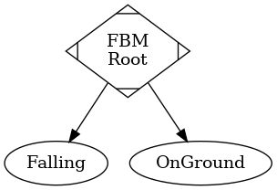
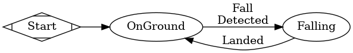

# Falling Body Machine
The most basic machine. Developed as a debugging tool to so we can see how sprites sit on a surface, given certain collision models. All it does is fall/move downward.

### Configurables
This machine features the standard configurable items for a machine `State` (see the *addons* directory for more, and the *xsm* subdirectory for EVEN MORE).

##### FSM Owner
As with every machine, the *FSM Owner* is required to be a `KinematicBody` node.

##### Kinematic Core
We require a `KinematicCore` node to define the movement profile for this machine.

### (Public) Variables
##### `_curr_orient`
A `Vector3`, where each axis is the current (rough) heading on each axis. The number is actually equivalent to the last updated velocity on each axis - however, it should only really be used to gauge "heading" or "orientation".

The values are irregularly updated in order to preserve continuity between states. This is particularly necessary for our sprites, which require an angle calculated from this `Vector3`. If this were to reset to (0, 0, 0) when not moving, the sprites would jerk into a common direction when at rest. Always.

##### `state_key`
A `String`, indicating the current state (i.e. Walk, OnGround, Falling, etc.). Useful for setting the sprites animation as well as debugging/display purposes.

### State Composition
Excluding the root state, there are two other states: 

1. *Falling*
1. *OnGround*

This looks like so:

The *OnGround* state is constantly probing downwards to ensure we are on the ground. If we aren't on the ground for whatever reason, we move to the *Falling* state.

While in the *Falling* state, the only thing we do is fall. That's it. Once we hit the ground, we move to the *OnGround* state.

The `visual_update` signal is regularly emitted throughout the *Falling* and *OnGround* states.

This whole process can be observed in this image:

