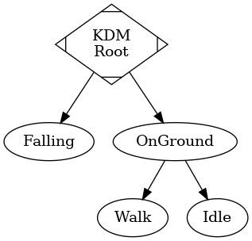
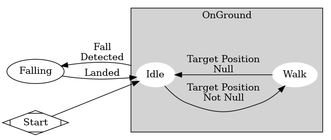

# Kinematic Driver Machine
The most basic way to impress a sense of intelligence upon an artificial object is to give it movement.

This is the second most basic machine. It blindly moves towards a target, or follows a path, while using the gravity mechanisms from the *Falling Body Machine* to interrupt the current state.

### Configurables
This machine features the standard configurable items for a machine `State` (see the *addons* directory for more, and the *xsm* subdirectory for EVEN MORE).

##### FSM Owner
As with every machine, the *FSM Owner* is required to be a `KinematicBody` node.

##### Kinematic Core
We require a `KinematicCore` node to define the movement profile for this machine.

### (Public) Variables
##### `target_position`
The current target position. Set to a `Vector3`, and the Pawn will move towards the specified position. It's recommended that you use the `move_to_point` and `clear_pathing` functions instead of manipulating this value directly.

##### `target_path`
The current target path. Set to an `Array` of `Vector3`s, and the Pawn will work through them, moving to each position. One after the other. It's recommended that you use the `move_to_point` and `clear_pathing` functions instead of manipulating this value directly.

##### `_curr_orient`
A `Vector3`, where each axis is the current (rough) heading on each axis. The number is actually equivalent to the last updated velocity on each axis - however, it should only really be used to gauge "heading" or "orientation".

The values are irregularly updated in order to preserve continuity between states. This is particularly necessary for our sprites, which require an angle calculated from this `Vector3`. If this were to reset to (0, 0, 0) when not moving, the sprites would jerk into a common direction when at rest. Always.

##### `state_key`
A `String`, indicating the current state (i.e. Walk, OnGround, Falling, etc.). Useful for setting the sprites animation as well as debugging/display purposes.

##### `_targ_dist_history`
An array containing the last `TARG_DIST_HISTORY_SIZE` measurements of our distance-to-target. That constant is defined in the `KinematicCore`. Used for error detection. Error detection and position tracking are not currently implemented.

### Functions
##### `move_to_point`
Instructs the machine to path-and-move from the target body's current position to the specified point. Behavior is undefined if a path cannot generated; most likely outcome is the integrating body defaults to the *Idle* state.

##### `clear_pathing`
Clears the pathing variables. This will cause the integrated body to stop moving.

### Signals
##### `path_complete`
Indicates that we reached our target position, and are all out of path nodes. The `target_position` variable is cleared before the signal is emitted. The `target_path` will be an empty array. The previous target position is given as a signal argument, just in case it is needed.

##### `error_goal_stuck`
This signal indicates that the integrated body is stuck. Stuck enough that our previous methods of getting un-stuck failed. This is basically a call for outside intervention. Despite our best efforts, this may not always fire whenever we get objectively stuck (it depends on how much we're "wiggling"). It's like, 99% effective.

### State Composition
Excluding the root state, there are four other states: 

1. *Falling*
1. *OnGround*
1. *Walk*
1. *Idle*

The *OnGround* state is a super state containing the *Walk* and *Idle* states. This can be observed in the arrangement of the states in the scene:

The machine defaults to the *Idle* state. If `target_position` is not null, we will move towards it via the *Walk* state. Once we reach the target position, the next path will be taken from `target_path`. Once `target_path` has been emptied, we will clear `target_position` and emit a `target_reached` signal. If a `target_position` is not set, and we have an empty `target_path`, we will revert to the *Idle* state.

Meanwhile, the *OnGround* state is constantly probing downwards to ensure we are on the ground. If we aren't, we begin falling, but *without* interrupting the subordinate states. This allows us some "airtime" where we walk on air. The airtime corresponds to the `KinematicCore`'s *Fall State Time Delay* configurable. Once we've fallen for that time duration, we transfer to the *Falling* state proper.

While in the *Falling* state, the only thing we do is fall. That's it. Once we hit the ground, we go to *Idle*.

This whole process can be observed in this image:

Note that the *OnGround* state contains the *Idle* and *Walk* states.