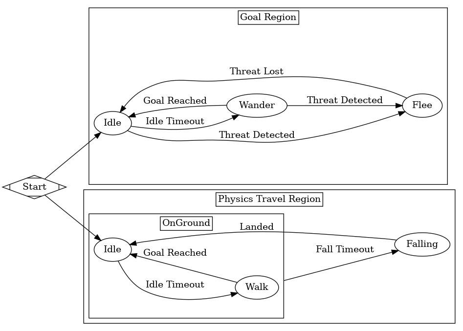
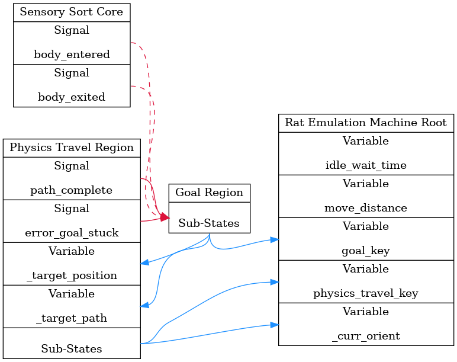

# Rat Emulation Machine
The machine features several states that control the pawn's pathing and movement, independent of the states that *actually perform* the movement. It can wait, it can wander around, and it can flee from danger. It's a big step forward for the AI.

This machine operates in three modes - in *Idle* mode, the machine doesn't move and waits. In *Wander* mode, the machine wanders in a random direction. In *Flee* mode, the machine moves *away* from 

### Configurables
This machine features the standard configurable items for a machine `State` (see the *addons* directory for more, and the *xsm* subdirectory for EVEN MORE).

##### FSM Owner
As with every machine, the *FSM Owner* is required to be a `KinematicBody` node.

##### Kinematic Core
We require a `KinematicCore` node to define the movement profile for this machine.

##### Sensory Sort Core
We require a `SensorySortCore` in order to detect the world around us and react appropriately.

##### Idle Wait Time
When in the *Idle* state, the machine waits for a certain amount of seconds before transitioning to the *Wander* state. This configurable controls the duration of that time period.

##### Move Distance
When moving in a given direction, the machine moves a fixed distance. This configurable controls the length of that distance.

### (Public) Variables

##### `_curr_orient`
A `Vector3`, where each axis is the current (rough) heading on each axis. The number is actually equivalent to the last updated velocity on each axis - however, it should only really be used to gauge "heading" or "orientation".

The values are irregularly updated in order to preserve continuity between states. This is particularly necessary for our sprites, which require an angle calculated from this `Vector3`. If this were to reset to (0, 0, 0) when not moving, the sprites would jerk into a common direction when at rest. Always.

##### `physics_travel_key`
A `String`, indicating the current *Physics-Travel* state (i.e. Idle, Walk, Falling, etc.). Useful for setting the sprites animation as well as debugging/display purposes.

##### `goal_key`
A `String`, indicating the current *Goal* state (i.e. Idle, Wander, Flee, etc.). Mostly used for debugging/display purposes, but can also be used to flavor the sprite's animation. For example, we may use an alternate *Flee* animation for when we're in the *Walk* *Physics-Travel* state if we're in the *Flee* *Goal* state.

> There is another variable, \_machine\_configured. This is an internal variable that forces the machine to reconfigure itself. Do not mess with it.

### State Composition
The Machine is divided into two regions. The first is the *Physics Travel Region*, which captures the earlier *Kinematic Driver Machine* in miniature. It has the following nodes:

1. *Falling*
1. *OnGround*
1. *Walk*
1. *Idle*

The *OnGround* state is a super state containing the *Walk* and *Idle* states.

The other region is the *GoalRegion*, which feeds data into the *Physics Travel Region*. It is, in effect, the actual "thinking" ethos component. It has the following nodes:

1. *Idle*
1. *Wander*
1. *Flee*

The Tree Structure can be observed below:

### State Control Flow

As we have two regions, we have effectively have two sub-machines:

##### Goal Region
The main states are the *Idle* and *Wander* states. If, at any point, we detect a body intruding in our sensory area, we transition to the *Flee* state. We return from the *Flee* state to the *Idle* state.

In the *Idle* state, we wait for the amount of time specified by the *Idle Wait Time* configurable before transition to the *Wander* state.

In the *Wander* state, we move in a random direction. Once we've completed that particular path, we move back to the *Idle* state.

##### Physics Travel Region
The machine defaults to the *Idle* state. If we have any *move/pathing data*, we will move towards it via the *Walk* state. Once we reach a target position, the next target position will be taken from our path data. Once we have no *move data*, we return to idle.

Meanwhile, the *OnGround* state is constantly probing downwards to ensure we are on the ground. If we aren't, we begin falling, but *without* interrupting the subordinate states. This allows us some "airtime" where we walk on air. The airtime corresponds to the `KinematicCore`'s *Fall State Time Delay* configurable. Once we've fallen for that time duration, we transfer to the *Falling* state proper.

While in the *Falling* state, the only thing we do is fall. That's it. Once we hit the ground, we go to *Idle*.

This whole process can be observed in this image:

Note that the *OnGround* state contains the *Idle* and *Walk* states.

### State Data Flow

The manipulation and flow of data in tightly controlled to try and keep things clean. Here "data flow" refers to either observing and reacting to changes in data (i.e. signals), **or** directly manipulating variables.

The *REM* data flow is represented here, where blue is data manipulation and red is a signal reaction:

What's important to not here is that, while the *Goal Region* does react to signals emitted by the *Physics Travel Region*, there is no direct manipulation from the *Physics Travel Region* to the *Goal Region*. Since signals are open-ended (anyone who wants to listen can feel free) they don't count as direct manipulation.

So, despite being sibling regions, the *Physics Travel Region* is considered wholly subordinate to the *Goal Region*. Of course, it does help that the *Goal Region* doesn't have any variables to manipulate or signals to listen to.

Anyway, you can also observe how data only really flows upwards to the *Root*; nothing flows backwards.