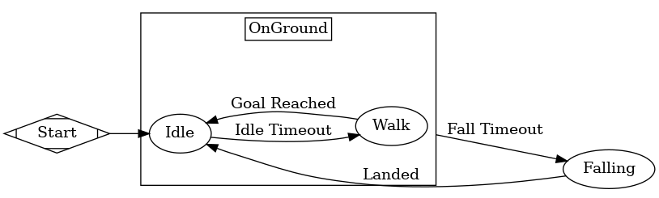

# Tasking Coward Machine
Building from the bipartite architecture of the *Rat Emulation Machine*, this machine uses a tripartite architecture. The three levels correspond to what we would consider high-level, mid-level, and low-level processing. Unlike the *Rat Emulation Machine*, these different levels are implemented as wholly separate machines instead of regions within the same machine. Since this is externally indistinguishable, we still refer to the *Tasking Coward Machine* as a *machine* for documentation purposes - though it is not a true XSM machine.  

At the highest level, we have the *Goal Region*, which acts provides the ground for what the machine is currently doing - in other words, each state of the *Goal Region* can be seen as a *reason* for us doing something.

At the middle level, we have the *Task Manager*. The task manager handles the different tasks assigned by the *Goal Region*. These tasks are machines themselves and give us a generic interface for making any and all AI perform actions.

At the lowest level, we have the *Physics Travel Region*. This region handles movement and collision, allowing the higher levels to simply deal with whether or not the task was successful (instead of intense semantics such as resolving collisions against collisions or testing for being stuck).

This machine operates in three modes - in *Idle* mode, the machine occasionally wanders in a random direction. In *Flee* mode, the machine moves *away* from whatever the perceived *Threats* are. When so ordered (via the `move_items` function), the machine will move into the *Move Tasked* state, moving the appropriate items. Note that the machine will enter *Flee* mode from either *Idle* or the *Move Tasked* state. See *State Control Flow* below.

### Configurables
In order to handle tasks, it was necessary to implement the tripartite architecture using three separate XSM structures. This means the machine doesn't have the typical XSM configurables. These configurables hew as close as possible to the standard configurables of other machines.

##### Integrating Body
The node that is integrating this machine. This is required to be a `KinematicBody` node. This will be the body moved by the *Physics Travel Region*, and will be the `target` operated on by any given tasks.

##### Kinematic Core
We require a `KinematicCore` node to define the movement profile for this machine.

##### Sensory Sort Core
We require a `SensorySortCore` in order to detect the world around us and react appropriately.

##### Level Interface Core
We require a `LevelInterfaceCore` in order to interact with the level at large. This includes checking positions and pathing to given destinations.

##### Idle Wait Time
When in the *Idle* state, the machine waits for a certain amount of seconds before transitioning to the *Wander* state. This configurable controls the duration of that time period.

##### Wander Distance
When the machine is in the wander state, it will randomly pick a direction and move in that direction. How far does it move in that direction?

##### Flee Distance
When the machine is in the flee state, it will calculate the best direction to move given what it is fleeing from. How far does it move in that direction? Note that it has been observed that too small a distance will cause the integrating body to do a quasi-stutter move. The sum effect is a very SLOW fleeing process.

### (Public) Variables

##### `_curr_orient`
A `Vector3`, where each axis is the current (rough) heading on each axis. The number is actually equivalent to the last updated velocity on each axis - however, it should only really be used to gauge "heading" or "orientation".

The values are irregularly updated in order to preserve continuity between states. This is particularly necessary for our sprites, which require an angle calculated from this `Vector3`. If this were to reset to (0, 0, 0) when not moving, the sprites would jerk into a common direction when at rest. Always.

##### `physics_travel_key`
A `String`, indicating the current *Physics-Travel* state (i.e. Idle, Walk, Falling, etc.). Useful for setting the sprites animation as well as debugging/display purposes.

##### `goal_key`
A `String`, indicating the current *Goal* state (i.e. Idle, Wander, Flee, etc.). Mostly used for debugging/display purposes, but can also be used to flavor the sprite's animation. For example, we may use an alternate *Flee* animation for when we're in the *Walk* *Physics-Travel* state if we're in the *Flee* *Goal* state.

> There is another variable, \_machine\_configured. This is an internal variable that forces the machine to reconfigure itself. Do not mess with it.

### State Composition
The Machine is composed of three separate XSM machines that feed in to one another. The first is the *Physics Travel Region*, which captures the earlier *Kinematic Driver Machine* in miniature. It has the following nodes:

1. *Falling*
1. *OnGround*
1. *Walk*
1. *Idle*

The *OnGround* state is a super state containing the *Walk* and *Idle* states.

The second machine is whatever task the machine is currently performing. This is handled by a *TaskManager* node, which we'll not cover here. The task's root node will actually be an XSM `StateRoot`. The machine may or may not have a task at any given time, meaning the number of machines constantly fluctuates between two and three.

The final region is the *GoalRegion*, which assigns different tasks. It is, in effect, the actual "thinking" ethos component. It has the following nodes:

1. *Idle*
1. *Move Tasked*
1. *Flee*

The Tree Structure can be observed below. Note that these are separate because they are no longer part of a contiguous XSM:

### State Control Flow

As we have two regions, we have effectively have two sub-machines:

##### Goal Region
Our default state is the *Idle* state. If, at any point, we detect a *Threat* body intruding in our *Fight or Flight* sensory area, we transition to the *Flee* state. We return from the *Flee* state to the *Idle* state.

In the *Idle* state, we wait for the amount of time specified by the *Idle Wait Time* configurable before issuing ourselves a *Wander* task. Once that task completes, we again wait for the configured time before assigning another *Wander* task - so on and so forth.

In the *Wander* state, we move in a random direction. Once we've completed that particular path, we move back to the *Idle* state.

The *Goal Region* process can be observed in this image:

##### Physics Travel Region
The machine defaults to the *Idle* state. If we have any *move/pathing data*, we will move towards it via the *Walk* state. Once we reach a target position, the next target position will be taken from our path data. Once we have no *move data*, we return to idle.

Meanwhile, the *OnGround* state is constantly probing downwards to ensure we are on the ground. If we aren't, we begin falling, but *without* interrupting the subordinate states. This allows us some "airtime" where we walk on air. The airtime corresponds to the `KinematicCore`'s *Fall State Time Delay* configurable. Once we've fallen for that time duration, we transfer to the *Falling* state proper.

While in the *Falling* state, the only thing we do is fall. That's it. Once we hit the ground, we go to *Idle*.

The *Goal Region* process can be observed in this image:

Note that the *OnGround* state contains the *Idle* and *Walk* states.

### State Data Flow

The manipulation and flow of data in tightly controlled to try and keep things clean. Keep that in mind when looking at this terribly messy graph - IT COULD ALWAYS BE WORSE!

Here "data flow" refers to either observing and reacting to changes in data (i.e. signals), **or** directly manipulating variables.

The *TCM* data flow is represented here, where blue is data manipulation and red is a signal reaction. Data flow from the *Sensory Sort Core* is dashed to help make the graph more legible:

Observe the path of data manipulations. Save for the state-read variables - `goal_key`, `physics_travel_key`, `_curr_orient` - the data manipulation flows left. The highest level of the tripartite architecture, the *Goal Region*, manipulates the *Task Manager Region*'s current task. The *Task Manager Region*, being the middle level, manipulates the *Physics Travel Region*. The *Physics Travel Region*, being the lowest level, doesn't manipulate either of the other regions.

What flows "up" through the levels are the signals - the *Physics Travel Region* forces decisions in the current task-action via signals, and the *Task Manager Region* forces decisions in the current goal-state via signals.

The *Sensory Sort Core*, which acts as the machine's sensory apparatus, emits signals that are caught by both the *Task Manager Region* and the *Goal Region*. While not spectacular it is safe because the *Core* is never directly manipulated. In addition, because the *Task Manager Region* is subordinate to the *Goal Region*, decisions in the more important *Goal Region* will override decisions in the *Task Manager Region*. In other words, it doesn't matter if both regions get the same signal; the **most important signal** will always win out.