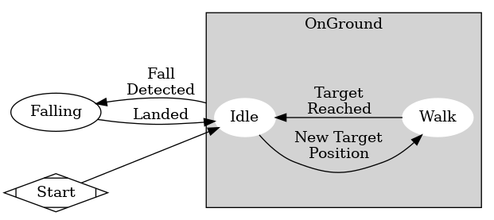

# GraphViz Scripts
>Note: These scripts are mostly used for generating documentation; ergo, the documentation isn't as thorough as scripts that are part of our asset pipeline.

[GraphViz](https://graphviz.org/) is a cross-platform program that can quickly and consistently create node-and-edge graphs, like the one below. These graphs are perfect for documenting Godot's scene trees and the pretty complex state machines we use throughout the project.



*GraphViz* works in different ways across different platforms, but these scripts should be acceptable input for any of the latest versions.

In Ubuntu 20.04, these scripts are compiled using a series of commands. So far, all of the scripts are Dot graphs, so we use the following command:

```bash
dot -Tpng [input].dot -o [output].png
```

## KDM Hierarchy and Flow
These two scripts concern our most basic AI machine - the *Kinematic Driver Machine*, frequently abbreviated to the *KDM*. Since it's a machine, it has a complex structure and process.

The *Hierarchy* script creates a graph showing the arrangement of states in the *KDM* scene. That's not too radical but it's key to understanding the next graph.

That would be the graph created by the *Flow* script. This depicts how the states relate to each other and the conditions that cause movements between the states. This is something that otherwise can only be discerned via code inspection.