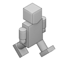
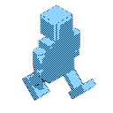
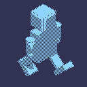
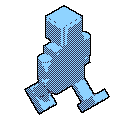
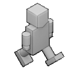

# ImageMagick Scripts
>Note: this README was written for those who may be unfamiliar with ImageMagick or Linux in general. These scripts are part of this project's art asset pipeline and may be used by people who aren't Linux pros or have even used Unix at all. The script descriptions will still be useful for more advanced users - just, maybe not the description of what constitutes a "shell".

[ImageMagick](https://imagemagick.org/index.php) is a powerful, command-line image processing program. These ImageMagick scripts are written for Ubuntu Linux 20.04's default shell, *Bash*. These scripts allow for quick, efficient, and consistent processing of input images to outputs.

For those not in the know, *shell* is a catch-all term for the specific program that runs in a operating system's terminal emulator - more commonly known as a *command line* or a *terminal*. Think stereotypical hacker. The *shell* is the part of the terminal that actually takes user input and runs programs & commands.

There are many shell variations in Unix-based operating systems. Ubuntu uses *Bash*, while Mac OS' *Terminal* program uses the *Z Shell (zsh)*. Microsoft Windows isn't a Unix descendant, so *cmd.exe* is the closest analogous program. *Windows PowerShell* also serves as a secondary command line shell, complete with it's own scripting language.

For most shells, it's possible to write out a series of commands into a file, then run that file as a script. The file extensions vary depending on the shell being used - the most common for Unix shells will be `.sh`, while Windows users might recognize `.bat` files.

Here's where the real power of *ImageMagick* comes in. Since it's a command line utility, we can essentially glue together different ImageMagick commands using your operating system's preferred commands. Since ImageMagick allows us to pass it files in batches, this means we can go from Blender's output (8 angle-frames per animation frame) to a finished sprite sheet in a matter of seconds.

As previously stated, these scripts were written for *bash* in Ubuntu 20.04. They should run on just about any Ubuntu version, but aren't guaranteed and will most likely not run on other shells. And they **definitely** won't run in *cmd.exe*. For that reason, I'll be explaining what each script does in detail - both the algorithm (so the steps can be duplicated in an image editor) and the ImageMagick commands (so you can run the commands manually or write your own script).

One final note - a lot of these descriptions reference a **wildcard**. In Unix shells, this is a file path with a `*`, where the `*` can match any number of characters. This allows us to specify a range of files - for example, all of the PNG images in a folder would be `*.png`. All images that start with the word "sprite" would be `sprite*.png`. Any file containing the letter 'a' would be `*a*`. So on and so forth.

## `sprite_poster_dither.bash`
This script takes in a file path, a wildcard (representing what images you want process), and a color palette.  It does three things:

1. Posterizes the image, reducing the total number of colors.
2. Remaps the image, mapping the colors in the image to any colors present in the palette.
3. Applies a [dithering](https://en.wikipedia.org/wiki/Dither) algorithm of the user's choice.

Observe these sample input and output images:

 

This script is unique in that it uses the `whiptail` command to present the user with a GUI. I thought this was necessary due to the breadth of dithering choices.

ImageMagick is one of the few programs that offers comprehensive dithering **WITH** color mapping. Most image programs tend to look at dithering as backwards and useless, which to me ignores the artistic potential of the technique. Using dithering and color remapping, we can create stylized sprites with ease.

#### Algorithm Explanation
ImageMagick cannot run a dithering command on an image with alpha (*transparency*). Well, you can, but it all comes out as one color. So, in order to preserve the input image's alpha layer (which is very important for our sprites) we must extract it first:

```bash
magick convert [Input File Path] -alpha extract [Output File Path]
```

For our sample images, this was:

```bash
magick convert input_00.png -alpha extract sp_po_di_01.png
```

This yields a black-and-white image mask, like so:


Now we can actually apply the dither. Since the alpha messes with the dither, we have to apply `-alpha off`. We also remap to the provided color palette using `-remap`. 

```bash
magick convert [Input File Path] -alpha off [Dither Choice] -remap [Color Palette Path] [Output File Path]
```

There are a lot of different dithering algorithms you can provide. The [ImageMagick site has a list](https://imagemagick.org/script/command-line-options.php#ordered-dither), but beware that not all of them seem to work. Also, there's an [older set of documentation with more algorithms](http://www.imagemagick.org/Usage/quantize/#colors) that we use in the script.

For our sample images, this was:

```bash
magick convert input.png -alpha off -ordered-dither checks -remap resurrect64_chit10.png sp_po_di_02.png
```

This produces a dithered image mapped to the colors specified, like so:



Note that the colors in the result image depend on the input image - if the input didn't have a wide range of colors, neither will the output.

Now that we have the dithered image, we can apply the alpha mask.

```bash
magick convert [Dithered Image Path] [Alpha Mask Path] -alpha Off -compose CopyOpacity -composite [Output Image Path]
```

For our sample images, this was:

```bash
magick convert sp_po_di_02.png sp_po_di_01.png -alpha Off -compose CopyOpacity -composite sp_po_di_03.png
```

This finally creates a final sprite, like so:


## `sprite_edge_add.bash`
This script takes in a file path, and a wildcard (representing what images you want process). It then adds a black border along any alpha edge. It eliminates any feathering that could cause render issues down the line.

Observe these sample input and output images:

 

 

This helps give any sprites a distinctive edge to help it stand out against a background. This is also important for some of our shaders that alpha out black for various effects.

#### Algorithm Explanation

In order to get an edge, we need to first handle any semi-transparent pixels (feathering) on the sprite itself. To do that, we run a threshold operation on the alpha channel - this will force every sprite to either be completely transparent or completely opaque:

```bash
magick convert [Input File Path] -channel a -threshold 0 +channel [Output File Path]
```

For our sample images, this was:

```bash
magick convert input_00.png -channel a -threshold 0 +channel sp_ed_ad_01.png
```

The effect is subtle, but is also noticeably different from the starting sprite - notice the edges:



With that done, we can now run an edge detection threshold on the previous output to get a thin outline.

```bash
magick convert [Alpha Cutoff Path] -edge 1 -channel RGB -threshold 100% [Edge Image Path]
```

For our sample images, this was:

```bash
magick convert sp_ed_ad_01.png -edge 1 -channel RGB -threshold 100% sp_ed_ad_02.png
```

This produces a hollow outline, like so:


Now it's just a matter of laying the edge image on top of the original image.

```bash
magick composite -gravity center [Edge Image Path]  [Original Image Path] [Output File Path]
```

For our sample images, this was:

```bash
magick composite -gravity center sp_ed_ad_02.png input_00.png sp_ed_ad_03.png
```

We now have a composite image with an outline, like so:


## `sprite_sheetmaker.bash`

This is actually a pretty simple script - it takes in a file path, a wildcard (representing what images you want in the spritesheet), and a matrix specification (i.e. 8x8 or 2x3). The matrix specification is `[Images-per-row]x[Images-per-column]`. It arranges all the images that match the specified wildcard into a spritesheet.

Note that it arranges them by the order they come in the wildcard - which is typically sorted alphanumerically.

#### Algorithm Explanation

ImageMagick actually comes with a command for doing this, so we don't need to tie a bunch of different commands together:

```bash
magick montage [Input Files] -tile [Matrix Size] -geometry +0+0 -background none [Output File Path]
```
